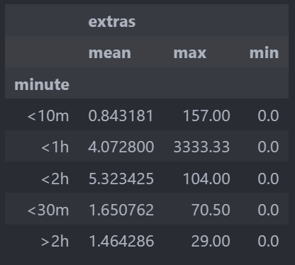

# EDA
Package Dependencies :
-   [pandas](https://github.com/pandas-dev/pandas)
-   [google-cloud-bigquery](https://github.com/googleapis/python-bigquery)

## Load Data
Connects to a Google BigQuery project using a service account and retrieves data from a specified dataset.

Requirements component to setup :
-   Service Account
-   Project ID
-   Region
-   BigQuery Table

Step-by-step to loading a dataset from BigQuery:
1. Load Credentials.
- The script loads the service account credentials from the JSON key file using service_account.Credentials.from_service_account_file.

2. Define Project ID
- The project ID associated with BigQuery dataset is specified in the project_id variable.

3. Create BigQuery Client
- The bigquery.Client is instantiated with the loaded credentials and project ID.

4. Define and Execute Query
- The SQL query to be executed is defined in the query variable. The client.query(query) method runs the query.

5. Convert Results to DataFrame
- The results of the query are converted into a Pandas DataFrame using query_job.to_dataframe() for easy manipulation and analysis.

6. Display the Results
- The DataFrame is printed to display the query results.

### Missing Value Check

Census tracts with over 80% missing data for pickup and dropoff are excluded. Due to privacy reasons, the Census Tract is not displayed for certain trips.

### Invalid Data Check

Invalid data includes:
- Cases where trip_second or trip_miles are greater than 0, but trip_total is 0.
- Cases where trip_second or trip_miles are 0, but trip_total is greater than 0.
- Cases where trip_second, trip_miles, and trip_total are all 0.

### Statistics

There are instances of data with unusually high extra costs, even though the location, distance, and time are different from those typically associated with high average extra costs.

## Preprocessing

-   Handle missing Value
    Fill the missing data with 0
-   Drop invalid data
    Drop the trip_second / trip_miles > 0, but trip_total = 0 and remove anomaly if extras < 1000
-   Feature selection
    Selection feature is : 'trip_seconds','trip_miles','pickup_community_area','dropoff_community_area','fare','tolls','extras','tips'.

    'trip_seconds' can be replace with trip_minute

# Cloud Functions

## Requirement packages

-   [functions_framework](https://github.com/GoogleCloudPlatform/functions-framework-python)
-   [google-auth](https://github.com/googleapis/google-auth-library-python/blob/main/LICENSE)
-   [request]()

Function `hello_gcs` will be triggered by cloud event by GCS, and will retrieve data such as name and bucket. The `hello_gcs` function requires Google Cloud credentials.

The `hello_gcs` function will send a request with data in the following format to the dataflow url :

```json
header
{
    "Authorization": f"Bearer {creds.token}",
    "x-goog-user-project": "dla-ml-specialization",
    "Content-Type": "application/json; charset=utf-8"
}

body
{
    "jobName": job_name,
    "environment": {
        "bypassTempDirValidation": False,
        "tempLocation": "gs://dla-ml-specialization-demo-dataset-1/DATAFLOW/temp/",
        "ipConfiguration": "WORKER_IP_UNSPECIFIED",
        "enableStreamingEngine": False,
        "additionalExperiments": [],
        "additionalUserLabels": {}
    },
    "parameters": {
        "input": gcs_path
    }
}
```

# Cloud Dataflow

## Setup

### Package dependencies:

-   [pandas](https://github.com/pandas-dev/pandas)
-   [google-cloud-storage](https://github.com/googleapis/python-storage)
-   [google-auth](https://github.com/googleapis/google-auth-library-python/blob/main/LICENSE)

### Environment setup

-   Set **GOOGLE_APPLICATION_CREDENTIALS** environment variable to the path of service account
-   define the **project_id**, **dataset_id**, and **table_id** that will be used in the BigQuery configuration
-   Define the BigQuery table where data will be written.
    ```
    table_schema = {
        "fields": [
            {"name": "trip_seconds", "type": "FLOAT", "mode": "NULLABLE"},
            {"name": "trip_miles", "type": "FLOAT", "mode": "NULLABLE"},
            {"name": "pickup_community_area", "type": "FLOAT", "mode": "NULLABLE"},
            {"name": "dropoff_community_area", "type": "FLOAT", "mode": "NULLABLE"},
            {"name": "fare", "type": "FLOAT", "mode": "NULLABLE"},
            {"name": "tolls", "type": "FLOAT", "mode": "NULLABLE"},
            {"name": "extras", "type": "FLOAT", "mode": "NULLABLE"},
            {"name": "tips", "type": "FLOAT", "mode": "NULLABLE"}
        ]
    }
    ```

## Process

The `process` function will retrieve and download data from Google Cloud Storage, preprocess the data, and convert it into JSON format.

## Run the pipeline

Run the pipeline by adding some arguments taken from the command-line. Here are some command-line arguments that can be used:

-   **--input**: Path to the input data in GCS (default: gs://dla-ml-specialization-demo-dataset-1-raw-data/part_taxi_trips).
-   **--output**: BigQuery table to write the results to (default: demo_dataset_1.taxi_trips_clean).
-   **--experiments**: Experiments to enable (default: use_runner_v2).
-   **--requirements_file**: Path to the requirements file (default: requirements.txt).

# Vertex AI

## Pipeline

-   `get_cleaned_data`

    Get the cleaned data from BigQuery and save in CSV format.

    Package dependencies :

    -   [google-cloud-bigquery](https://github.com/googleapis/python-bigquery)
    -   [google-cloud-storage](https://github.com/googleapis/python-storage)
    -   [pandas](https://github.com/pandas-dev/pandas)
    -   [db-dtypes](https://github.com/googleapis/python-db-dtypes-pandas)

    Parameters :

    -   bq_source (str) : source dataset in BigQuery
    -   Clean_Data (Output[Dataset]) : object to save the output data

-   `split_the_data`

    Split the dataset to train_set and test_set

    Package dependencies :

    -   [scikit-learn](https://github.com/scikit-learn/scikit-learn)
    -   [pandas](https://github.com/pandas-dev/pandas)
    -   [google-cloud-storage](https://github.com/googleapis/python-storage)
    -   [fsspec](https://github.com/fsspec/filesystem_spec/blob/master/docs/source/index.rst)
    -   [gcsfs](https://github.com/fsspec/gcsfs)

    Parameters :

    -   Clean_Data (Input[Dataset]) : object input dataset
    -   Train_Data (Output[Dataset]) : object to save train dataset
    -   Val_Data (Output[Dataset]) : object to save validation dataset

-   `create_tensorflow_model`

    Create and save base model with tensorflow

    Dependencies :

    -   base image : gcr.io/deeplearning-platform-release/tf2-cpu.2-9:latest
    -   packages : [google-cloud-storage](https://github.com/googleapis/python-storage), [fsspec](https://github.com/fsspec/filesystem_spec/blob/master/docs/source/index.rst), [gcsfs](https://github.com/fsspec/gcsfs)

    Parameters :

    -   input_size (int): size for input layer
    -   hidden_layer_sizes (int): size for hidden layer
    -   output_size (int): size for output layer
    -   activation_name (str): name for activation layer in hidden layer
    -   output_activation_name (str): name for action layer in output layer
    -   Base_Model (Output[Model]): object to save model

-   `train_model`

    Train a base model and save the trained model

    Dependencies :

    -   base_image : gcr.io/deeplearning-platform-release/tf2-cpu.2-9:latest
    -   packages : [google-cloud-storage](https://github.com/googleapis/python-storage), [fsspec](https://github.com/fsspec/filesystem_spec/blob/master/docs/source/index.rst), [gcsfs](https://github.com/fsspec/gcsfs)

    Parameters :

    -   Base_Model (Input[Model]): base model that will be used for training.
    -   Train_Data (Input[Dataset]): dataset used to train the model.
    -   learning_rate (float): learning rate used by the optimizer.
    -   optimizer_name (str): name optimizer that will be used.
    -   loss_function_name (str): name loss function that will be used.
    -   batch_size (int): batch size for training.
    -   label_column_name (str): column name for label.
    -   random_seed (int): seed for randomizing datasets to make results reproducible.
    -   metric_names (str): metric name that will used for evaluation.
    -   number_of_epochs (int): number of epoch for training.
    -   Trained_Model (Output[Model]): Objek Output to save trained model.

-   `test_model`

    Evaluate the performance of a trained TensorFlow model on a validation dataset. It calculates key evaluation metrics and logs them for further analysis.

    Dependencies :

    -   base image : gcr.io/deeplearning-platform-release/tf2-cpu.2-9:latest
    -   packages : [numpy](https://github.com/numpy/numpy),[google-cloud-storage](https://github.com/googleapis/python-storage), [fsspec](https://github.com/fsspec/filesystem_spec/blob/master/docs/source/index.rst), [gcsfs](https://github.com/fsspec/gcsfs)

    Parameters :

    -   Trained_Model (Input[Model]): The trained model to be evaluated.
    -   Val_Data (Input[Dataset]): The validation dataset used for evaluating the model.
    -   label_column_name (str): The name of the column in the dataset that contains the labels.
    -   batch_size (int): The batch size to be used for evaluation.
    -   metrics (Output[Metrics]): An object to log the computed metrics.

-   `upload_model_to_vertex_ai`

    Upload a trained TensorFlow model to Google Vertex AI

    Dependencies :

    -   base image : gcr.io/deeplearning-platform-release/tf2-cpu.2-9:latest
    -   packages : [google-cloud-aiplatform](https://github.com/googleapis/python-aiplatform), [google-cloud-storage](https://github.com/googleapis/python-storage), [fsspec](https://github.com/fsspec/filesystem_spec/blob/master/docs/source/index.rst), [gcsfs](https://github.com/fsspec/gcsfs)

    Parameters :

    -   Trained_Model (Input[Model]): An Input object containing the path to the trained TensorFlow model directory.
    -   use_gpu (bool): A boolean flag indicating whether to use a GPU for serving the model.
    -   display_name (str): The display name for the model in Vertex AI.
    -   description (str): A description of the model.
    -   project (str): Google Cloud project id.
    -   location (str): Google cloud location / region where the model will be uploaded.

    Return :

    Return the `resource_name` of the uploaded model in Vertex AI

-   `deploy_model_to_vertex_ai_endpoint`

    deploy a trained model to a Vertex AI endpoint for serving prediction.

    Dependencies :

    -   base image : gcr.io/deeplearning-platform-release/tf2-cpu.2-9:latest
    -   packages : [google-cloud-aiplatform](https://github.com/googleapis/python-aiplatform), [google-cloud-storage](https://github.com/googleapis/python-storage), [fsspec](https://github.com/fsspec/filesystem_spec/blob/master/docs/source/index.rst), [gcsfs](https://github.com/fsspec/gcsfs)

    Parameters :

    -   model_name (str): The name of the model to be deployed on Vertex AI.
    -   endpoint_name (str, optional): The name of an existing endpoint to deploy the model to. If not provided, a new endpoint will be created.
    -   machine_type (str, default="n1-standard-2"): The type of machine to use for serving the model.
    -   min_replica_count (int, default=1): The minimum number of machine replicas for the deployment.
    -   max_replica_count (int, default=1): The maximum number of machine replicas for the deployment.
    -   accelerator_type (str, optional): The type of accelerator to attach to the machine.
    -   accelerator_count (str, optional): The number of accelerators to attach to the machine.

    Return :
    Return the `endpoint_name` where the model is deployed

-   `pipeline`

    function used to define the sequence of steps that must be performed, starting from get_cleaned_data to deploy_model_to_vertex_ai_endpoint

    Parameters :

    -   bigquery_dataset (str): source dataset in BigQuery.
    -   MODEL_DISPLAY_NAME (str): Display name for the model in Vertex AI.
    -   MACHINE_TYPE (str): Machine type to use for deployment.
    -   project (str): Google Cloud project ID.
    -   gcp_region (str): Google Cloud region.

## Run the Pipeline

Run the previously created pipeline by adding the following parameters:

-   **display_name**: The name displayed in the AI Platform for this pipeline job.
-   **template_path**: The path to the pipeline YAML file which defines the structure and components of the pipeline.
-   **pipeline_root**: The root directory in Google Cloud Storage where the pipeline artifacts will be stored.
-   **parameter_values**: A dictionary of parameters passed to the pipeline, which include:
    -   **project**: The Google Cloud project ID where the pipeline will be executed.
    -   **gcp_region**: The Google Cloud region where resources will be provisioned.
    -   **bigquery_dataset**: The BigQuery source table or query used as input data for the pipeline.
    -   **MODEL_DISPLAY_NAME**: The display name for the model resource.
    -   **MACHINE_TYPE**: The type of machine to be used for training and other operations.
-   **enable_caching**: A boolean flag to disable caching of pipeline steps to ensure the pipeline runs from scratch each time.
